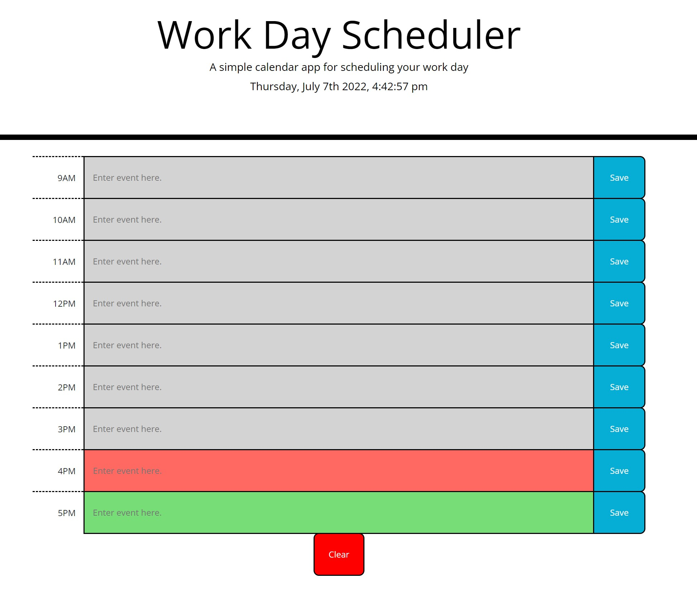
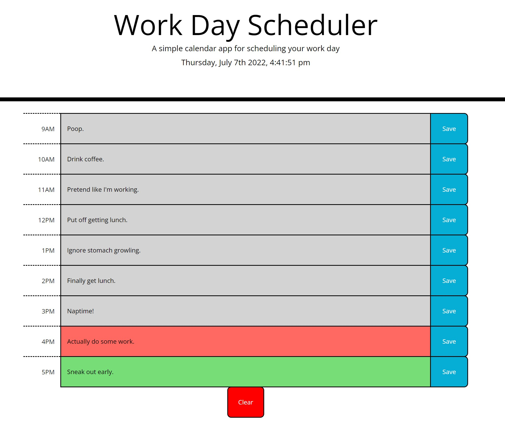

# Work-Day-Planner
[](https://opensource.org/licenses/MIT)   

## Description  

The objective of this challenge is to create a app that allows me to utilize bootstrap, jQuery, and moment.js to make a daily planner.

**User Story**
```
AS AN employee with a busy schedule
I WANT to add important events to a daily planner
SO THAT I can manage my time effectively
```

**Acceptance Criteria**
```
GIVEN I am using a daily planner to create a schedule
WHEN I open the planner
THEN the current day is displayed at the top of the calendar
WHEN I scroll down
THEN I am presented with timeblocks for standard business hours
WHEN I view the timeblocks for that day
THEN each timeblock is color coded to indicate whether it is in the past, present, or future
WHEN I click into a timeblock
THEN I can enter an event
WHEN I click the save button for that timeblock
THEN the text for that event is saved in local storage
WHEN I refresh the page
THEN the saved events persist
```

## Table of Contents  
1. [Description](#description)
2. [Deployment](#deployment)
3. [Optimizations](#optimizations)
4. [Contributing](#contributing)  
5. [Questions](#questions)  
6. [License](#license)

## Deployment

[Deployed Website](https://mmelan000.github.io/Work-Day-Planner/)





## Optimizations

- Added live clock.
- Minimalistic amounts of code to allow for quick load.
- Mobile friendly.
- Added clear button.

## Contributing  

Follow best practices for naming conventions, indentation, quality comments, etc.  

## Questions  

If you have any questions, please reach out to me either on Github or by Email.
  - **Github:** [mmelan000](https://github.com/mmelan000)
  - **Email:** [m.melanson000@gmail.com](mailto:m.melanson000@gmail.com)

## License  

- [MIT](https://opensource.org/licenses/MIT)