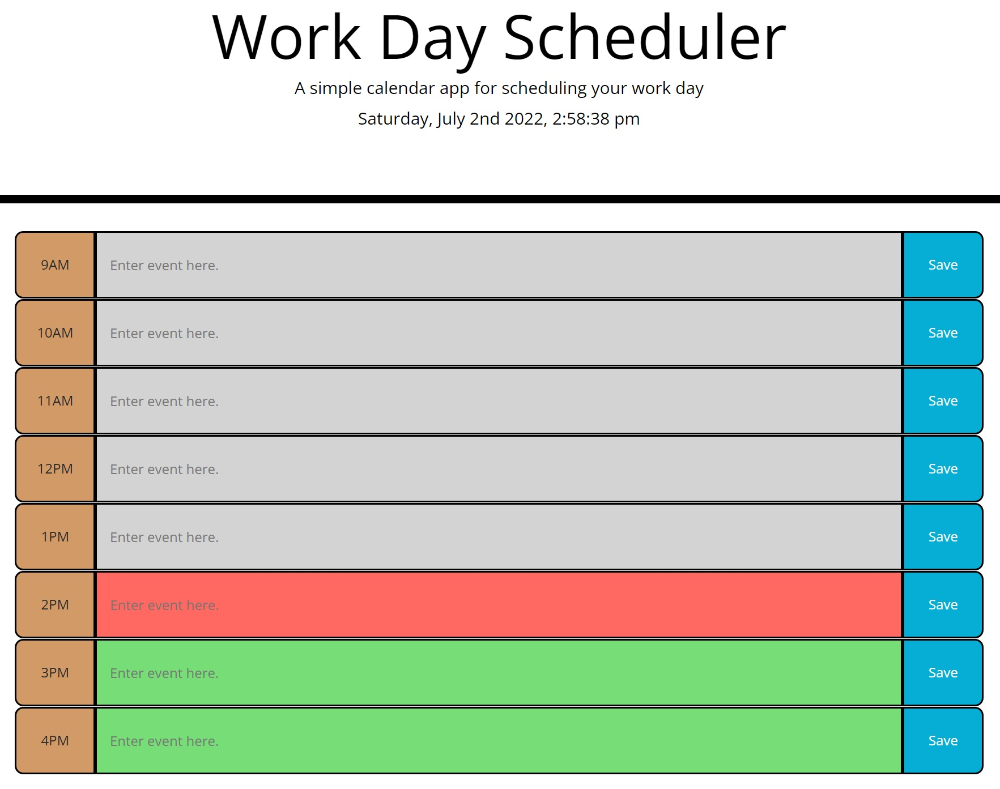
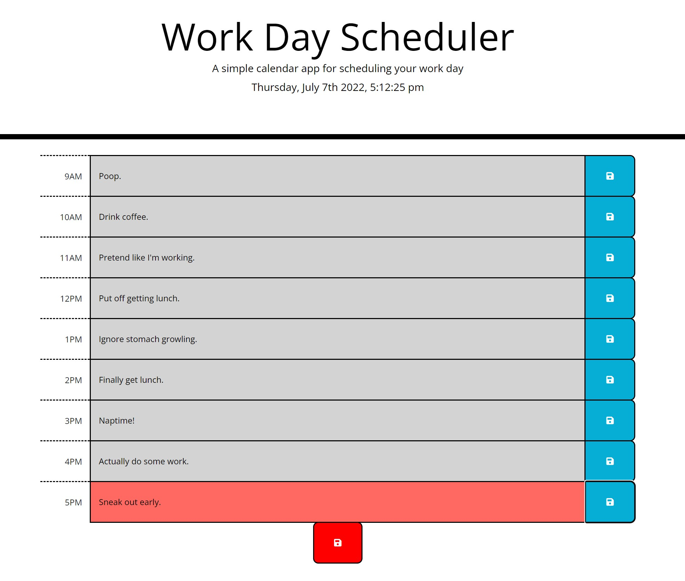

# Challenge-04-Web-APIs-Code-Quiz

The objective of this challenge is to create a app that allows me to utilize bootstrap, jQuery, and moment.js to make a daily planner.

**User Story**
```
AS AN employee with a busy schedule
I WANT to add important events to a daily planner
SO THAT I can manage my time effectively
```

**Acceptance Criteria**
```
GIVEN I am using a daily planner to create a schedule
WHEN I open the planner
THEN the current day is displayed at the top of the calendar
WHEN I scroll down
THEN I am presented with timeblocks for standard business hours
WHEN I view the timeblocks for that day
THEN each timeblock is color coded to indicate whether it is in the past, present, or future
WHEN I click into a timeblock
THEN I can enter an event
WHEN I click the save button for that timeblock
THEN the text for that event is saved in local storage
WHEN I refresh the page
THEN the saved events persist
```

---

## Authors

- [@Michael Melanson](https://github.com/mmelan000)

---

## Screenshots





---

## Optimizations

- Added live clock.
- Minimalistic amounts of code to allow for quick load.
- Mobile friendly.

---

## Deployment

https://mmelan000.github.io/Challenge-05-Third-Party-APIs-Work-Day-Scheduler/

---
